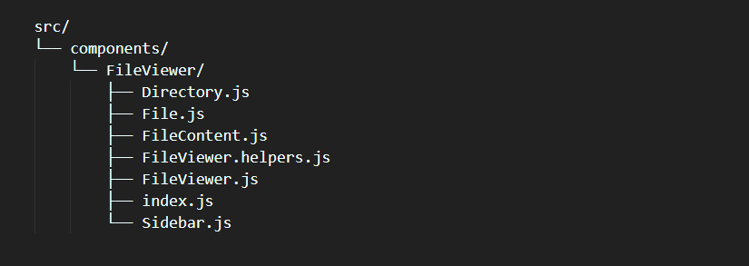

Time for you to build a delightful and organized React project file structure? Hop in and see what you've missed!

# Introduction

React is renowned for being agnostic about file and directory organization. How should you structure the files and directories in your applications?

Because React has not established any standards, its flexibility makes it challenging to build a project using React. Well, there is no one "right" way, but I tried a lot of different approaches. I eventually came up with a solution that I'm pretty pleased with.

In this blog post, I'll outline three distinct folder structures in this article that can apply to projects of all sizes. The complexity of these structures is listed from the simplest to the most complicated.

However, depending on the size of your project, a more straightforward approach might be preferable.

Before I get going on the various folder structures, I want to make one point. Only the files and folders included in the src folder will be addressed. There is no appropriate, universal structure utilizing outside of the src folder because your files will be very project-specific and rely substantially on the libraries you use.

# My Priorities

Let's begin by discussing my priorities and the areas I've optimised for.

First and foremost, I want to make it easy to import components. The ideal situation would be able to write this:

Next: when I'm working in my IDE, I dont want to be flooded with `index.js` files. To be fair, most editors will now include the parent directory when multiple index.js files are open at once, but then each tab takes up way more space. I've worked on projects where the top bar looked like this:

My goal, is to have nice, organized, clear component file names, like this:

Finally, in terms of organization, I prefer that things be arranged by function rather than feature. I want a "components" directory, a "hooks" directory, a "helpers" directory, and so on.

Sometimes, larger and more complex components will have a bunch of associated files coming with them. These include:

- "Sub-components", smaller component parts used exculsively by their respective main component

- Custom hooks

- Helper functions

- Constants or data shared between components and its associated files

To make things clear, let's talk about the `FileViewer` component as an example. Here are the files created specifically for this component:

- `FileViewer.js` — the main component

- `FileConent,js` — the component that renders the contents of a file, with syntax highlighting

- `Sidebar.js` — the list of files and directories on the side that is used to explore the whole page

- `Directory.js` — the collapsible directory, used in the sidebar

- `File.js` — an individual file, used in the sidebar

- `FileViewer.helpers.js` — one of the helper functions to help traverse the tree and assist in managing the expanding / collapsing functionality

All of these documents ought to be concealed, out of sight. They should only be shown to me when I'm working on the FileViewer component since I only need them then.

# The Implementation

Let's now discuss how my implementation responds to these priorities.

## Components

Here is an example component that has every file and directory needed to achieve my objectives:

The majority of these files are those that were previously described and required for the `FileViewer` component. Just `index.js` is an exception. That's new.

If we look inside, we will discover something a little odd:

In essence, this is a redirection. We will redirect to the `FileViewer.js` file in the same directory when we attempt to import this file. This component's actual code locates in `FileViewer.js`.

**Why not just leave the code in index.js?** The `index.js` files will eventually fill up our editor. I don't need that.

**Why is this file even there?** That makes imports easier. Simply put, we'd have to manually choose the file by navigating to the component directory and doing something like this:

Ideally, with out `index.js` following, we can shorten it to just:

**Why does this work?** `FileViewer` is a directory, so the bundler will look for files like `index.js`, `index.ts`, etc. when we endeavor to import a directory. `My-Website.com` will automatically try to load `index.html` as per a convention carried over from web servers, saving the user from having to type `my-Website.com/index.html`.

I believe that conceptualizing this in terms of an HTTP request is helpful. The bundler will detect that we are importing a directory when we import `src/components/FileViewer`, and it will immediately load `index.js`. The `index.js` performs a figurative 301 REDIRECT to `src/components/FileViewer/FileViewer.js`.

Although it may seem overly engineered, I like this structure because it meets all my requirements.

## Hooks

<!--  -->

The easiest way to make your first post is to edit this one. Go into /_posts/ and update the Hello World markdown file. For more instructions head over to the [Jekyll Now repository](https://github.com/barryclark/jekyll-now) on GitHub.
