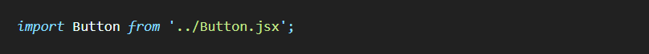
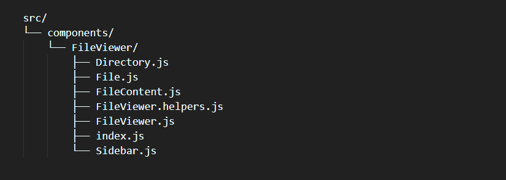
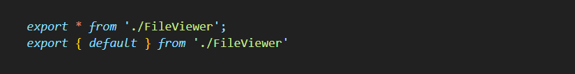
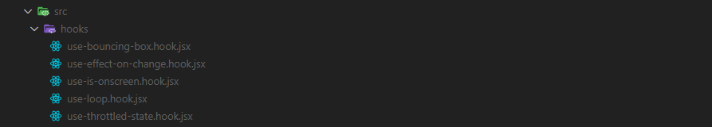
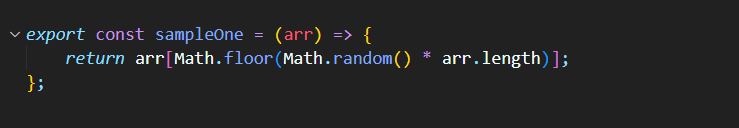
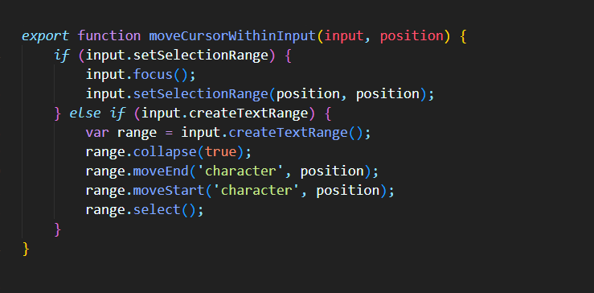
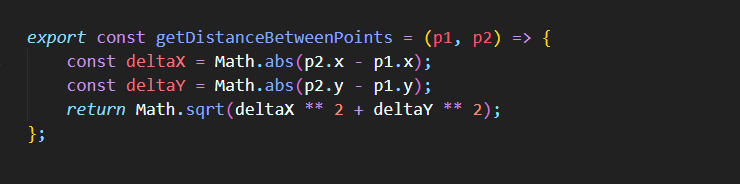

Have you ever used React state and wanted to sync with a form field? How do you go about it?


It depends on the form control type: text inputs, selects, checkboxes, and radio buttons all function differently.

Although the details may differ, the good news is that all follow the same basic process. React, in particular, adheres to a uniform philosophy in terms of data binding.

In this blog post, we'll first cover how React handles data binding, and then I'll walk you through each form field individually. We will examine complete, real-world instances, and I will also offer some tips I've found handy, as well as specific "gotchas" to avoid!

❕

**Intended audience**

<span style="color:grey" font size="0.6">
Intended audience
</span>

<span style="color:grey" font size="0.6">
This article is meant for React developers who are beginners to intermediate levels. You don't require extensive React experience, but I presume you have some familiarity with state, event handlers, and related concepts.
</span>

# Introduction to controlled fields

Let's get started with the code mechanism React uses for data binding: rendering an `<input>`

```jsx
function App() {
  return (
    <input />
  );
}
```

React takes a very "hands-off" approach by default, creating the `<input>` DOM node and then leaving it alone. Making it an uncontrolled element since React does not actively manage it.

We can also choose to let React manage the form field for us by using the `value` attribute for text inputs.

```jsx
import React from 'react';

function App() {
  return (
    <input value="Welcome to my blog" />
  );
}

export default App;
```

Give the code a try and edit the text in the input. It doesn't work! Why's that?

This is known as a *controlled* element. React is on guard, ensuring that the input always displays the string "Welcome to my blog".

Locking the `value` to a static string like this isn't beneficial nor common! I'm doing it to show how controlled elements function. React's input is "locked" so it always contains the `value` we passed in.

When we pass a *dynamic value*, true magic happens. For example, let's consider another scenario:

```jsx
import React from 'react';

function App() {
  const [count, setCount] = React.useState(0);

  return (
    <>
      <input value={count} />
      
      <button onClick={() => setCount(count + 1)}>
        Increment
      </button>
    </>
  );
}

export default App;
```

Check out the "Increment" button by clicking it and see what happens to thr text input.

Instead of binding the input to a static string, we have bounded the input to a state variable called `count`. When clicking the "Increment" button, the state variable changes from `0` to `1`. React then re-renders this component and updates the value in the `<input>` to reflect this new state.

Yet, we are still unable to type in the text entry! The input has been locked to the value of the count state variable by React.

This is referred to as "one-way" data binding in data-binding parlance. When the state changes, the input updates, but the state does not:


To achieve a complete loop, we would need *two-way* data binding to accomplist it:

```jsx
import React from 'react';

function App() {
  const [state, setState] = React.useState('Hello World');

  return (
    <>
      <input
        value={state}
        onChange={(event) => {
          setState(event.target.value);
        }}
      />
      <p>
        <strong>Current value:</strong>
        {state}
      </p>
    </>
  );
}

export default App;
```

The onChange attribute receives an event listener. When the user modifies the text input, this function is called, and the event object is passed as a parameter.

event.target refers to the DOM node that triggered the event. In this case, the text input has a value attribute representing the value that the user has just tried to enter into the input.

We changed our React state to reflect this new value, and then React re-renders the page and inserts the updated value into the input. This cycle has concluded!

These are the fundamental ideas behind React data-binding. Two main components:

This is the fundamental idea behind data binding in React. The two ingredients are:

- A “controlled” field, locking the React state to an input.

- An onChange handler, updating the state variable whenever new input from the user appears.

With that being said, we now have a functional two-way data binding.


# My Priorities

Let's begin by discussing my priorities and the areas I've optimised for.

First and foremost, I want to make it easy to import components. The ideal situation would be able to write this:



Next: when I'm working in my IDE, I dont want to be flooded with `index.js` files. To be fair, most editors will now include the parent directory when multiple index.js files are open at once, but then each tab takes up way more space. I've worked on projects where the top bar looked like this:


My goal, is to have nice, organized, clear component file names, like this:


Finally, in terms of organization, I prefer that things be arranged by function rather than feature. I want a "components" directory, a "hooks" directory, a "helpers" directory, and so on.

Sometimes, larger and more complex components will have a bunch of associated files coming with them. These include:

- "Sub-components", smaller component parts used exculsively by their respective main component

- Custom hooks

- Helper functions

- Constants or data shared between components and its associated files

To make things clear, let's talk about the `FileViewer` component as an example. Here are the files created specifically for this component:

- `FileViewer.js` — the main component

- `FileConent.js` — the component that renders the contents of a file, with syntax highlighting

- `Sidebar.js` — the list of files and directories on the side that is used to explore the whole page

- `Directory.js` — the collapsible directory, used in the sidebar

- `File.js` — an individual file, used in the sidebar

- `FileViewer.helpers.js` — one of the helper functions to help traverse the tree and assist in managing the expanding / collapsing functionality

All of these documents ought to be concealed, out of sight. They should only be shown to me when I'm working on the FileViewer component since I only need them then.

# The Implementation

Let's now discuss how my implementation responds to these priorities.

## Components

Here is an example component that has every file and directory needed to achieve my objectives:



The majority of these files are those that were previously described and required for the `FileViewer` component. Just `index.js` is an exception. That's new.

If we look inside, we will discover something a little odd:



In essence, this is a redirection. We will redirect to the `FileViewer.js` file in the same directory when we attempt to import this file. This component's actual code locates in `FileViewer.js`.

**Why not just leave the code in index.js?** The `index.js` files will eventually fill up our editor. I don't need that.

**Why is this file even there?** That makes imports easier. Simply put, we'd have to manually choose the file by navigating to the component directory and doing something like this:


Ideally, with out `index.js` following, we can shorten it to just:


**Why does this work?** `FileViewer` is a directory, so the bundler will look for files like `index.js`, `index.ts`, etc. when we endeavor to import a directory. `My-Website.com` will automatically try to load `index.html` as per a convention carried over from web servers, saving the user from having to type `my-Website.com/index.html`.

I believe that conceptualizing this in terms of an HTTP request is helpful. The bundler will detect that we are importing a directory when we import `src/components/FileViewer`, and it will immediately load `index.js`. The `index.js` performs a figurative 301 REDIRECT to `src/components/FileViewer/FileViewer.js`.

Although it may seem overly engineered, I like this structure because it meets all my requirements.

## Hooks

I'll keep a hook with that component if it's unique to that component. What happens, though, if the hook is generic and intended to be used by a variety of components?

I have roughly 10 all-purpose, reusable hooks in this blog. The `src/hooks` directory has a collection of them. These are a few instances:



There's 2 things i'll like to mention here:

1. I add .hook to the end of each hook name to ensure clarity.

2. I use kebab-case instead of camelCase for better visibility.

There's no specific reasoning for making these decisions. I just like the way it looks. 😄

It's perfectly acceptable to name your hooks useThing.js instead of use-thing.hook.js! The convention you choose to employ for your file names is irrelevant.

## Helpers

What if I have a function that, while not directly linked to a component, will assist me in achieving some project goal?

For instance, this blog offers several categories for blog posts, such as `React`, `CSS`, and `JavaScript`. I have a few functions that allow me to retrieve the formatted or "pretty" name for the category or to arrange the categories by the number of posts. Everything of it belongs to a category. `src/helpers` contain the `helpers.js` file.

Occasionally, a function will begin in a file specific to a component, such as `FileViewer/FileViewer.helpers.js`. But I soon realized I required it in several places, converting it to `src/helpers`.

## Utils

There's some explanation needed, bear with me as I go on.

Many developers consider "helpers" and "utils" as synonyms, but I see them as separate concepts.

A helper is anything that is customized to a project. Sharing helpers between projects is typically not a good idea; the `category.helpers.js` functions are basically just useful for this blog.

A utility is a generic function that performs a specific purpose. To me, almost every function in the `lodash` library is a utility.

Here's an example of a tool I frequently use. It selects an item at random from an array:


I have a `utils.js` file consisting of these kinds of utility functions.

Why not use a well-known utility library like `lodash`? If it's not something I can easily build myself, I will. Yet no utility library will have all of the utilities I require.

For example, this one moves the user's pointer within a text input:



Also, this utility calculates the separation between two points on a cartesian plane (which is a question that surprisingly frequently arises in projects with complex animations):



## Constants

Finally, I have a `constants.js` file. Constants used by the whole app are being stored in this file. While the majority of them are style-related (such as colors, font sizes, and breakpoints), I also save public keys and other "app data" in this location.

I carry these tools from project to project and they are located in src/utils.js. The file could be copied and pasted when I start a new project. To maintain uniformity across projects, I could publish it through NPM, but that would cause a great deal of friction, and I haven't found that to be a worthwhile trade-off. Perhaps in the future, but not yet.

## Pages

The concept of pages is the one thing that is absent here.

This portion depends on the tools you use thus leaving it off. I don't have pages when using a tool like `create-react-app`. Instead, everything is a component. When utilizing `Next.js`, however, I have `/src/pages`, which contain top-level components that outline the general organization of each route.

# Conclusion

There's really no clear-cut definition for your file structure. I'm simply sharing my practice to those that seek improvement. However, if you find a practise that works for you, stick with it. React is adaptable to our applications, allowing you to be creative while also being efficient.
