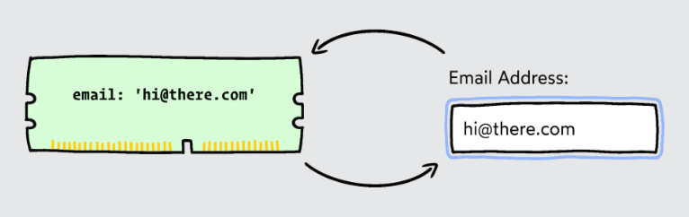
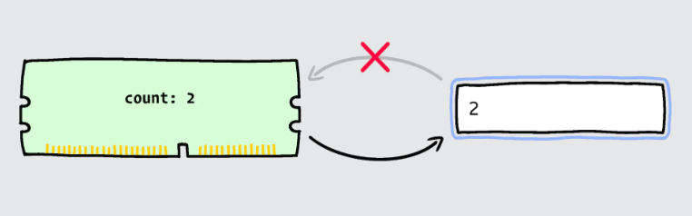
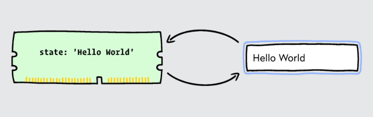
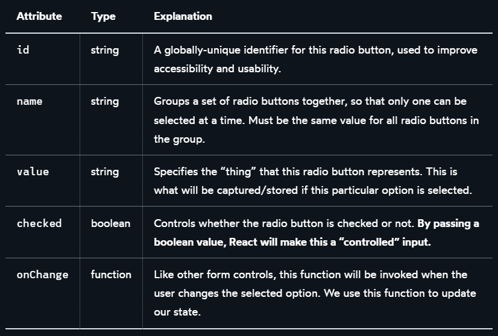
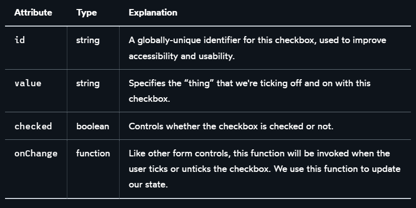

Have you ever used React state and wanted to sync with a form field? How do you go about it?



It depends on the form control type: text inputs, selects, checkboxes, and radio buttons all function differently.

Although the details may differ, the good news is that all follow the same basic process. React, in particular, adheres to a uniform philosophy in terms of data binding.

In this blog post, we'll first cover how React handles data binding, and then I'll walk you through each form field individually. We will examine complete, real-world instances, and I will also offer some tips I've found handy, as well as specific "gotchas" to avoid!

❕

<span style="color:grey" font size="0.6">
Target Audience
</span>

<span style="color:grey" font size="0.6">
❝ This article is meant for React developers who are beginners to intermediate levels. You don't require extensive React experience, but I presume you have some familiarity with state, event handlers, and related concepts. ❞
</span>

# Introduction to controlled fields

Let's get started with the code mechanism React uses for data binding: rendering an `<input>`

```jsx
function App() {
  return (
    <input />
  );
}
```

React takes a very "hands-off" approach by default, creating the `<input>` DOM node and then leaving it alone. Making it an uncontrolled element since React does not actively manage it.

We can also choose to let React manage the form field for us by using the `value` attribute for text inputs.

```jsx
import React from 'react';

function App() {
  return (
    <input value="Welcome to my blog" />
  );
}

export default App;
```

Give the code a try and edit the text in the input. It doesn't work! Why's that?

This is known as a *controlled* element. React is on guard, ensuring that the input always displays the string "Welcome to my blog".

Locking the `value` to a static string like this isn't beneficial nor common! I'm doing it to show how controlled elements function. React's input is "locked" so it always contains the `value` we passed in.

When we pass a *dynamic value*, true magic happens. For example, let's consider another scenario:

```jsx
import React from 'react';

function App() {
  const [count, setCount] = React.useState(0);

  return (
    <>
      <input value={count} />
      
      <button onClick={() => setCount(count + 1)}>
        Increment
      </button>
    </>
  );
}

export default App;
```

Check out the "Increment" button by clicking it and see what happens to thr text input.

Instead of binding the input to a static string, we have bounded the input to a state variable called `count`. When clicking the "Increment" button, the state variable changes from `0` to `1`. React then re-renders this component and updates the value in the `<input>` to reflect this new state.

Yet, we are still unable to type in the text entry! The input has been locked to the value of the count state variable by React.

This is referred to as "one-way" data binding in data-binding parlance. When the state changes, the input updates, but the state does not:



To achieve a complete loop, we would need *two-way* data binding to accomplist it:

```jsx
import React from 'react';

function App() {
  const [state, setState] = React.useState('Hello World');

  return (
    <>
      <input
        value={state}
        onChange={(event) => {
          setState(event.target.value);
        }}
      />
      <p>
        <strong>Current value:</strong>
        {state}
      </p>
    </>
  );
}

export default App;
```

The onChange attribute receives an event listener. When the user modifies the text input, this function is called, and the event object is passed as a parameter.

event.target refers to the DOM node that triggered the event. In this case, the text input has a value attribute representing the value that the user has just tried to enter into the input.

We changed our React state to reflect this new value, and then React re-renders the page and inserts the updated value into the input. This cycle has concluded!

These are the fundamental ideas behind React data-binding. Two main components:

This is the fundamental idea behind data binding in React. The two ingredients are:

- A “controlled” field, locking the React state to an input.

- An onChange handler, updating the state variable whenever new input from the user appears.

With that being said, we now have a functional two-way data binding.



React's key philosophy is that the UI is generated from the state and any changes in the state trigger updates in the UI. Controlled elements are a natural extension of this concept, where assigning a value for a text input indicates that the input content is also generated from React state.

<p style="text-align: center;">〰️〰️〰️〰️〰️〰️〰️</p>

Moving on, let's take a look at how this pattern can be implemented across multiple input types.

# Text Inputs

```jsx
import React from 'react';

function App() {
  const [name, setName] = React.useState('');
  
  return (
    <>
      <form>
        <label htmlFor="name-field">
          Name:
        </label>
        <input
          id="name-field"
          value={name}
          onChange={event => {
            setName(event.target.value);
          }}
        />
      </form>
      
      <p>
        <strong>Current value:</strong>
        {name || '(empty)'}
      </p>
    </>
  );
}

export default App;
```

For the `value` and `onChange` attributes:

- The `value` attribute "locks" the input, preventing it from displaying anything other than the current value of our state variable.

- Modifying the input and updating the state triggers the `onChange` event when performed by the user.

I have a practice providing an `ID`. While not necessary for data binding, having globally unique IDs is essential for usability and accessibility. For the following section, we will explore how to automatically create these IDs using a new React hook.

## Text Input Variants

We can choose from an array of 'formatted' text inputs, in addition to plain text inputs, for things like email addresses, phone numbers, and credentials.

The good news is that these variants generally work the same way when it comes to data binding.

Here's how we'd connect a `password` input, for example:

```jsx
const [secret, setSecret] = React.useState('');
<input
  type="password"
  value={secret}
  onChange={(event) => {
    setSecret(event.target.value);
  }}
/>
```

## Gotchas

The `<input>` component can be converted into totally separate form controls, in addition to text input versions. We'll cover radio buttons, checkboxes, and specialty inputs like sliders and color pickers later in this blog post.
Gotchas
When dealing with text inputs, make sure to start with an empty string (`''`):

```jsx
// 🚫 Incorrect:
const [name, setName] = React.useState();
// ✅ Correct:
const [name, setName] = React.useState('');
```

<!-- ❕

<span style="color:grey" font size="0.6">
Why is this needed?
</span>

<span style="color:grey" font size="0.6">
❝ This article is meant for React developers who are beginners to intermediate levels. You don't require extensive React experience, but I presume you have some familiarity with state, event handlers, and related concepts. ❞
</span> -->

# Textareas

`<Textarea>` elements in React function precisely like text inputs. We use the same combination of `value` and `onChange`:

```jsx
import React from 'react';

function App() {
  const [comment, setComment] = React.useState('');
  
  return (
    <>
      <form>
        <label htmlFor="comment-field">
          Share your experiences:
        </label>
        <textarea
          id="comment-field"
          value={comment}
          onChange={event => {
            setComment(
              event.target.value
            );
          }}
        />
      </form>
      
      <p>
        <strong>Current value:</strong>
        {comment || '(empty)'}
      </p>
    </>
  );
```

## Gotchas

As with inputs, the initial value for the state variable should be an empty string (`''`).

```jsx
// 🚫 Incorrect:
const [comment, setComment] = React.useState();
// ✅ Correct:
const [comment, setComment] = React.useState('');
```

# Radio Buttons

Things now differ quite a bit when it comes to radio buttons.

Kicking off with this example:

```jsx
import React from 'react';

function App() {
  const [hasAgreed, setHasAgreed] = React.useState();

  return (
    <>
      <form>
        <fieldset>
          <legend>
            Do you agree?
          </legend>
          
          <input
            type="radio"
            name="agreed-to-terms"
            id="agree-yes"
            value="yes"
            checked={hasAgreed === "yes"}
            onChange={event => {
              setHasAgreed(event.target.value)
            }}
          />
          <label htmlFor="agree-yes">
            Yes
          </label>
          <br />
          
          <input
            type="radio"
            name="agreed-to-terms"
            id="agree-no"
            value="no"
            checked={hasAgreed === "no"}
            onChange={event => {
              setHasAgreed(event.target.value)
            }}
          />
          <label htmlFor="agree-no">
            No
          </label>
        </fieldset>
      </form>
      
      <p>
        <strong>Has agreed:</strong>
        {hasAgreed || "undefined"}
      </p>
    </>
  );
}

export default App;
```

That's a lot of attributes, and we'll go over them in more detail later. But before that, let me explain how our "controlled field" concept applies here.

With text inputs, our state and form control has a 1:1 relationship. A single `<input>` tag is associated with a single piece of state.

Several inputs are linked to a single piece of state using radio buttons. It's a one-to-many relationship, and this distinction results in differences in appearance.

With the example given above, the state will always be none other than one of the three only possible values:

- "yes" (first radio button value)
- "no" (second radio button value)
- "undefined" (no radio button checked)

Rather than locating the specific input's value, it's the option that's being ticked and is being tracked by the state variable.

The onChange handler displays the statement above at work:

```jsx
<input
  value="yes"
  onChange={(event) => {
    setHasAgreed(event.target.value);
    // Equivalent to: setHasAgreed("yes")
  }}
/>
```

When the user checks the input that represents the yes option, we copy its value into the state.

In a true two-way data binding, we need to make this a controlled input. In React, the checked attributes are manipulating the radio buttons.

```jsx
<input
  value="yes"
  checked={hasAgreed === "yes"}
/>
```

By setting the `checked` property to a boolean value, React will actively manage this radio button, and tick or untick the DOM node based on the `hasAgreed === "yes"` condition.

Regrettably, text inputs and radio buttons require separate properties to provide controlled entries, with `value` for text inputs and `checked` for radio buttons. This distinction often leads to confusion.

Surprisingly, this operating style does make sense when deciding what React is controlling:

For text input, React is responsible for handling the user's freeform text specified with a `value`.
For a radio button, React determines whether or not the user has chosen this option specified with `checked`

What about all of those other attributes? Here's a table showing what each attribute is responsible for:



## Iterative illustration

Because radio buttons require a large number of characteristics, it is often preferable to construct them dynamically through iteration. We'll have to create this code once!

Furthermore, in most circumstances, the alternatives will be dynamic (e.g., fetched from our backend API). In such circumstances, we should generate them using iteration.

Here's an example of how it's accomplished:

```jsx
import React from 'react';

function App() {
  const [
    language,
    setLanguage
  ] = React.useState('english');

  return (
    <>
      <form>
        <fieldset>
          <legend>
            Select language:
          </legend>
          
          {VALID_LANGUAGES.map(option => (
            <div key={option}>
              <input
                type="radio"
                name="current-language"
                id={option}
                value={option}
                checked={option === language}
                onChange={event => {
                  setLanguage(event.target.value);
                }}
              />
              <label htmlFor={option}>
                {option}
              </label>
            </div>
          ))}
        </fieldset>
      </form>
      
      <p>
        <strong>Selected language:</strong>
        {language || "undefined"}
      </p>
    </>
  );
}

const VALID_LANGUAGES = [
  'mandarin',
  'spanish',
  'english',
  'hindi',
  'arabic',
  'portugese',
];

export default App;
```

This may appear to be rather complicated, but all of the properties are ultimately used in the same way.

## Gotchas

When using iteration to build radio buttons dynamically, we should be careful not to mistakenly duplicate a variable name that's currently in use by our state variable.

Try to avoid doing this:

```jsx
const [language, setLanguage] = React.useState();
return VALID_LANGUAGES.map((language) => (
  <input
    type="radio"
    name="current-language"
    id={language}
    value={language}
    checked={language === language}
    onChange={event => {
      setLanguage(event.target.value);
    }}
  />
));
```

We're naming the map parameter `language` in our`.map()` method, be aware that the name used is already taken. `Language` is another name for our state variable.

This is referred to as 'shadowing,' and it effectively means that we no longer have access to the outer `language` value, which is a problem because we need it to set the `checked` attribute correctly!

As a result, when iterating over various `options`, I prefer to use the general option name:

```jsx

VALID_LANGUAGES.map(option => {
  <input
    type="radio"
    name="current-language"
    id={option}
    value={option}
    checked={option === language}
    onChange={event => {
      setLanguage(event.target.value);
    }}
  />
})
```

# Checkboxes

Checkboxes are comparable to radio buttons, but they have additional complexity.

Whether we're talking about a single checkbox or a collection of checkboxes, our techniques will vary.

Let's start with a simple example that only has one checkbox.

```jsx
import React from 'react';

function App() {
  const [optIn, setOptIn] = React.useState(false);

  return (
    <>
      <form>
        <input
          type="checkbox"
          id="opt-in-checkbox"
          checked={optIn}
          onChange={event => {
            setOptIn(event.target.checked);
          }}
        />
        <label htmlFor="opt-in-checkbox">
          <strong>Yes,</strong> I would like to join the newsletter.
        </label>
      </form>
      <p>
        <strong>Opt in:</strong> {optIn.toString()}
      </p>
    </>
  );
}

export default App;
```

With the `checked` property, we indicate that this should be a controlled input, similar to radio buttons. This enables us to synchronize the checkbox's status with our `optIn` state variable. When the user toggles the checkbox, we utilize the well-established `onChange` pattern to update the `optIn` state.

## Checkbox groups

Consider the following example of multiple checkboxes controlled by React state. Observe how checking or unchecking these boxes affects the resulting state.
This exercise can help you better understand the underlying mechanics at play.

```jsx
import React from 'react';

const initialToppings = {
  anchovies: false,
  chicken: false,
  tomatoes: false,
}

function App() {
  const [
    pizzaToppings,
    setPizzaToppings
  ] = React.useState(initialToppings);

  // Get a list of all toppings.
  // ['anchovies', 'chicken', 'tomato'];
  const toppingsList = Object.keys(initialToppings);
  
  return (
    <>
      <form>
        <fieldset>
          <legend>
            Select toppings:
          </legend>
          
          {/*
            Iterate over those toppings, and
            create a checkbox for each one:
          */}
          {toppingsList.map(option => (
            <div key={option}>
              <input
                type="checkbox"
                id={option}
                value={option}
                checked={pizzaToppings[option] === true}
                onChange={event => {
                  setPizzaToppings({
                    ...pizzaToppings,
                    [option]: event.target.checked,
                  })
                }}
              />
              <label htmlFor={option}>
                {option}
              </label>
            </div>
          ))}
        </fieldset>
      </form>
      <p>
        <strong>Stored state:</strong>
      </p>
      <p className="output">
        {JSON.stringify(pizzaToppings, null, 2)}
      </p>
    </>
  );
}

export default App;
```

In terms of HTML properties, things seem to be very similar to our iterative radio button approach.

However, how do we handle our React state, and what makes it an object?! Unlike radio buttons, several checkboxes can be checked, which significantly alters the state variable.

While we can pack all the necessary information into a single string using radio buttons (i.e., the `value` of the selected option), we need to keep track of more data because the user can select multiple options with checkboxes.

There are various approaches we can take, but my preferred method is to use an object with a boolean value for each option.

```jsx
const initialToppings = {
  anchovies: false,
  chicken: false,
  tomatoes: false,
}
```

We map over the keys of this object in the JSX and render a checkbox for each one. We then look up whether this particular option is selected during the iteration and use that information to manage the checkbox with the `checked` attribute.

Additionally, we assign a code to `onChange` that will flip the checkbox's value. To solve the problem of React state needing to be immutable, we construct a new object that is nearly identical to the original, but with the option in question flipped between true and false.

The following table shows the purpose of each attribute:



Like radio buttons, we can also provide a `name` for controlled inputs, although it isn't entirely necessary.

# Select

The `<select>` tag, similar to radio buttons, enables the user to select a single choice from a list of possible values. In most cases, we use `<select>` when there are too many options to display in a tidy manner using radio buttons.

Here's an example of how to associate it with a state variable:

```jsx
import React from 'react';

function App() {
  const [age, setAge] = React.useState('0-18');

  return (
    <>
      <form>
        <label htmlFor="age-select">
          How old are you?
        </label>
        
        <select
          id="age-select"
          value={age}
          onChange={event => {
            setAge(event.target.value)
          }}
        >
          <option value="0-18">
            18 and under
          </option>
          <option value="19-39">
            19 to 39
          </option>
          <option value="40-64">
            40 to 64
          </option>
          <option value="65-infinity">
            65 and over
          </option>
        </select>
      </form>
      
      <p>
        <strong>Selected value:</strong>
        {age}
      </p>
    </>
  );
}
 
export default App;
```

`<Select>` tags in React are quite similar to text inputs as we employ the same `value` and `onChange` combination. Even the `onChange` callback is the same!

If you've dealt with `<select>` tags in vanilla JS, this undoubtedly seems a little out of the ordinary. Generally, we'd need to set the `selected` attribute on the appropriate `<option>` child dynamically. The React team has taken a lot of liberties with `<select>`, smoothing off the rough edges and allowing us to link this form field to some React state using our familiar `value` + `onChange` combo.

That said, we still need to create the `<option>` children and specify appropriate values for each one. These are the strings that will be set into the state when the user selects a different option.

## Gotchas

Similarly, with text inputs, we must initialize the state to a valid value. Therefore, our state variable's initial value must be one of the following options.

```jsx
// This initial value:
const [age, setAge] = React.useState("0-18");
// Must match one of the options:
<select>
  <option
    value="0-18"
  >
    18 and under
  </option>
</select>
```

Watch out! With just one minor error, we risk encountering some perplexing issues.

To prevent the possibility of shooting ourselves in the foot, I prefer to build the option tags dynamically, utilizing a single source of truth.

```jsx
import React from 'react';

// The source of truth!
const OPTIONS = [
  {
    label: '18 and under',
    value: '0-18'
  },
  {
    label: '19 to 39',
    value: '19-39'
  },
  {
    label: '40 to 64',
    value: '40-64'
  },
  {
    label: '65 and over',
    value: '65-infinity'
  },
];

function App() {
  // Grab the first option from the array.
  // Set its value into state:
  const [age, setAge] = React.useState(OPTIONS[0].value);

  return (
    <>
      <form>
        <label htmlFor="age-select">
          How old are you?
        </label>
        
        <select
          id="age-select"
          value={age}
          onChange={event => {
            setAge(event.target.value)
          }}
        >
          {/*
            Iterate over that array, to create
            the <option> tags dynamically:
          */}
          {OPTIONS.map(option => (
            <option
              key={option.value}
              value={option.value}
            >
              {option.label}
            </option>
          ))}
        </select>
      </form>
      
      <p>
        <strong>Selected value:</strong>
        {age}
      </p>
    </>
  );
}

export default App;
```

As we have seen, the HTML tag `<input>` can take many different forms such as a text input, a password input, a checkbox, a radio button, or something else depending on the `type` attribute.

MDN specifies 22 possible legal `type` attribute values. Several of these are "special," with a unique appearance such as:

- sliders (with the `type="range"`)
- date selectors (with the `type=" date"`)
- color pickers (with the `type="color"`)

Fortunately, they all follow the same pattern as text inputs. When the input is edited, we use `value` to lock it to the state's value, and `onChange` to update that value.

Here's an example of how to use `<input type="range">`:

```jsx
import React from 'react';

function App() {
  const [volume, setVolume] = React.useState(50);
  
  return (
    <>
      <form>
        <label htmlFor="volume-slider">
          Audio volume:
        </label>
        <input
          type="range"
          id="volume-slider"
          min={0}
          max={100}
          value={volume}
          onChange={event => {
            setVolume(event.target.value);
          }}
        />
      </form>
      
      <p>
        <strong>Current value:</strong>
        {volume}
      </p>
    </>
  );
}

export default App;
```

```jsx
import React from 'react';

function App() {
  const [color, setColor] = React.useState('#FF0000');
  
  return (
    <>
      <form>
        <label htmlFor="color-picker">
          Select a color:
        </label>
        <input
          type="color"
          id="color-picker"
          value={color}
          onChange={event => {
            setColor(event.target.value);
          }}
        />
      </form>
      
      <p>
        <strong>Current value:</strong>
        {color}
      </p>
    </>
  );
}

export default App;
```
